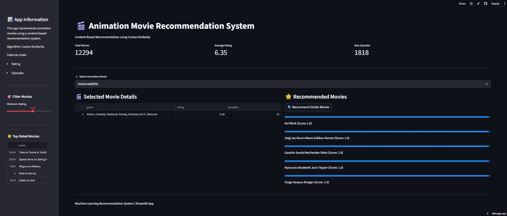

# Animation movie Recommendation System

## Overview
This project is a content-based Animation movie Recommendation System that recommends similar animation movies based on genre, rating, number of episodes, and popularity. The system uses TF-IDF feature extraction and cosine similarity to compute similarity between animation movies.

The application is deployed using Streamlit, allowing users to select an anime and receive similar anime recommendations.

---

## Features
- Content-based recommendation system
- Cosine similarity
- TF-IDF genre feature extraction
- Feature scaling for numeric features
- Streamlit web application
- Top-rated anime display
- Similar anime recommendations with similarity score
- Interactive user interface

---

## Technologies Used
- Python
- Pandas
- NumPy
- Scikit-learn
- TF-IDF Vectorizer
- Cosine Similarity
- Streamlit

---

## How the Recommendation System Works
1. Data preprocessing and cleaning
2. Genre converted into TF-IDF vectors
3. Numeric features (rating, episodes, members) normalized
4. Features combined into a single feature matrix
5. Cosine similarity calculated between anime
6. Top similar anime recommended to the user

---

## Project Structure

anime-recommendation-system
│
├── data
│ └── data.csv
│
├── notebooks
│ └── item-item-content-based-recommendation-system.ipynb
│
├── screenshots
│ └── App_screenshot.jpg
│
├── app.py
├── requirements.txt
├── README.md
└── .gitignore

---

## Installation
Install dependencies:
pip install -r requirements.txt

Run Streamlit app:
streamlit run app.py

---

## Screenshot

---

## Future Improvements
- Collaborative filtering recommendation system
- Matrix factorization (SVD)
- Deep learning recommendation system
- Anime poster display
- User rating based recommendation
- Deployment on cloud (Streamlit Cloud / AWS / Docker)

---

## Author
Kiran Kumar  
Machine Learning | Bioinformatics | AI Applications

